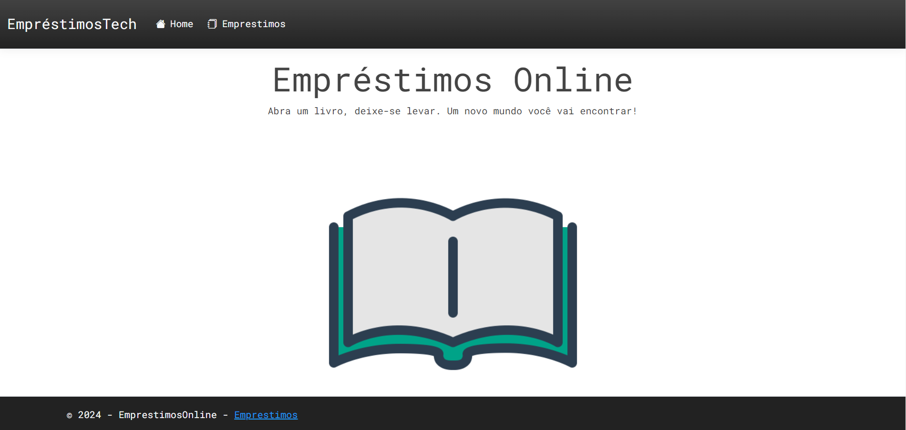
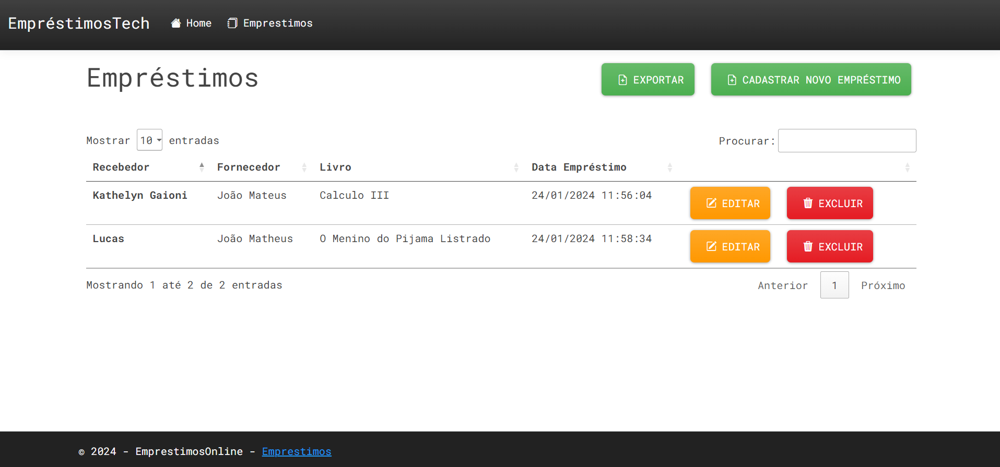

# Curso - Empréstimos Online

## Tecnologias utilizadas
*   ASP.NET Core
*   Entity Framework Core
*   SQL Server
*	Bootstrap

## Projetos do curso
*   Neste projeto construimos uma API de empréstimos de livros online

